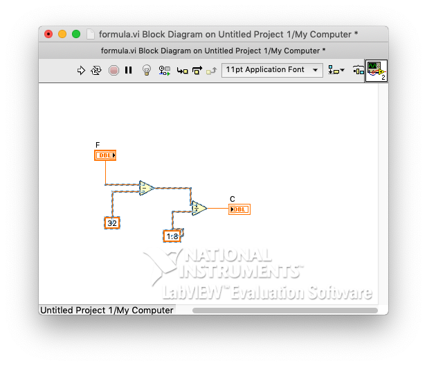
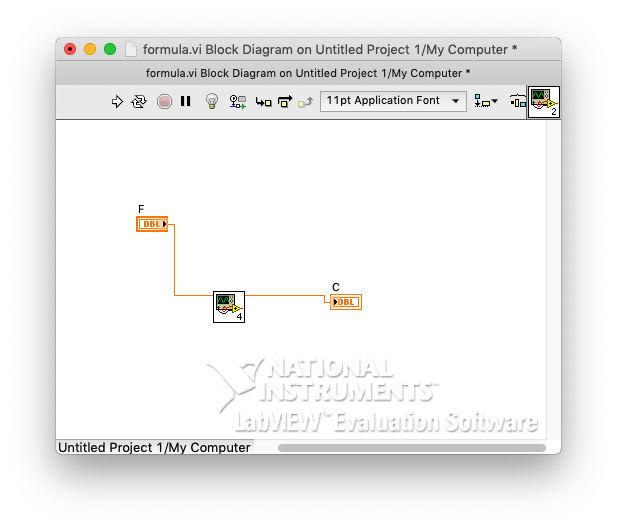
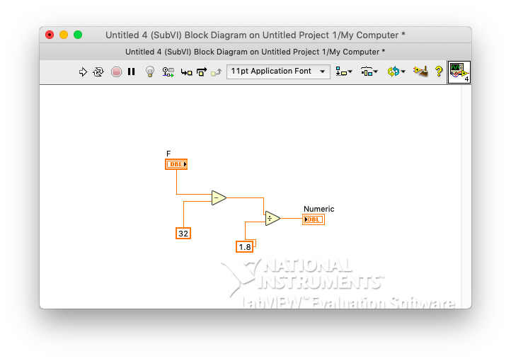
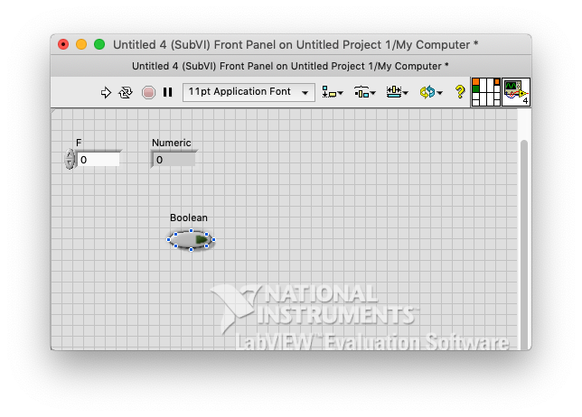
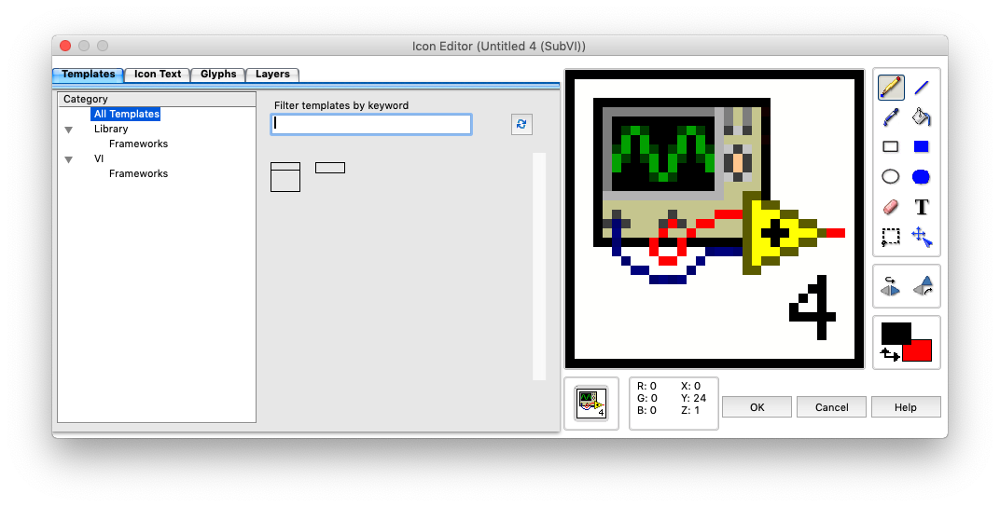
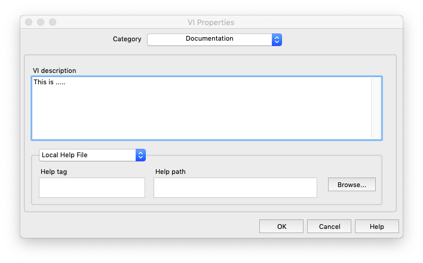
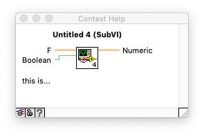
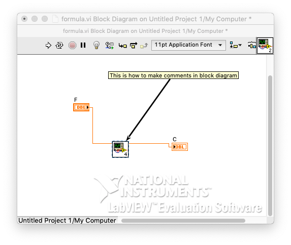

# 10. Module, subVI, document

### # subVI

- Double click(opne)

- Open block diagram(command E)

  

- add new function if wants

  - 

- Icon change

  - 

### # Document

- FrontPanel
  - file -> VI property
  - set top as Document
    - 
    - 

- Block Diagram
  - double click 
    - 