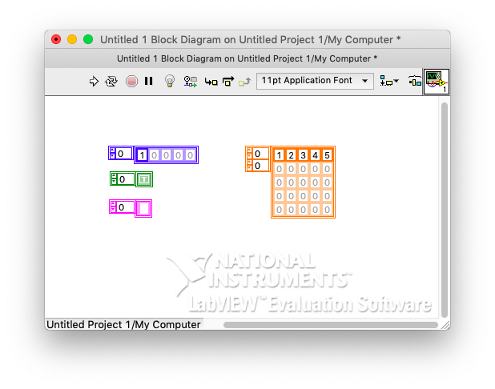
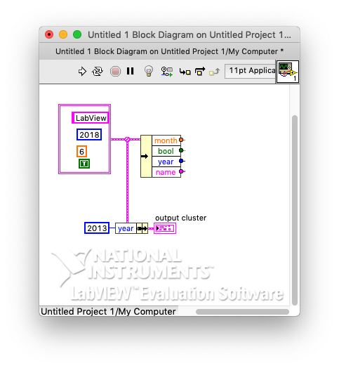
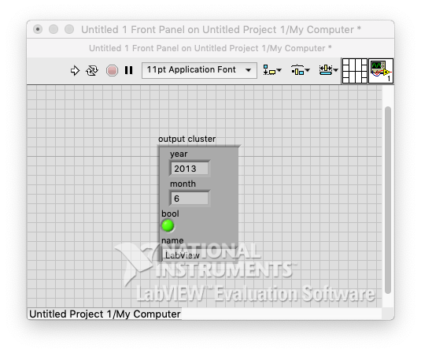

# 3. Array and Cluster

### # Array 

- make array
- Put type(int, string, bool...)
- Extend 2D, 3D

### 

### # Cluster 

- has different data types
- Set name (property)
- Select data 
  - unbundle by name
- Change datae 
  - bundle by name
  - link
  - create, constant
  - (Click right part) create, indicator, run
  - 

