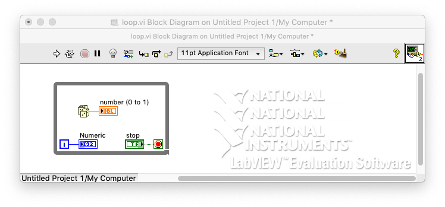
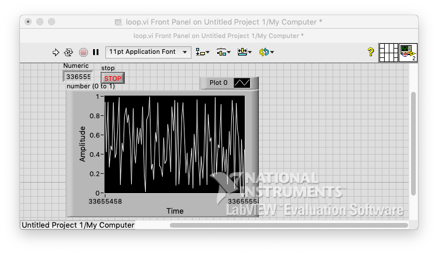
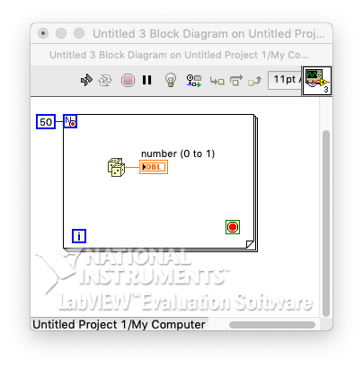
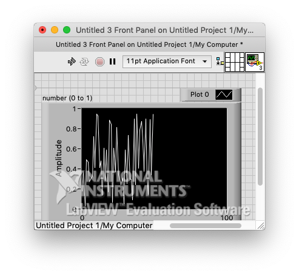
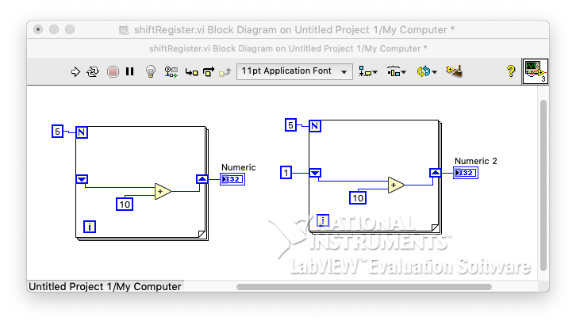
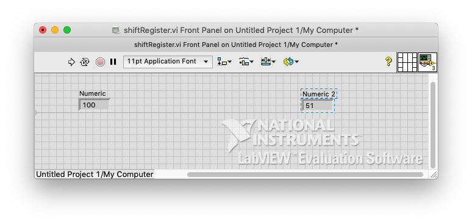

# 4. Loop, shift register, Terminal mode

### # while 

- Random num -> indicator, indacator to waveform chart
- i(right) -> indicator
- stop terminal(left) -> create control
- RUN -> random num
- STOP -> stop

### 

### # for

- Set the num of i
- but if you want to add one codition(stop)
  - Layout right click -> CONDITIONAL TERMINAL 
  - While loop condition button created

### 

### # Shift Register

- when reuse old data that is created via loop(Functional Global Variable)

- Click layout -> Add Shift Register

### # Terminal mode

- need to work on

