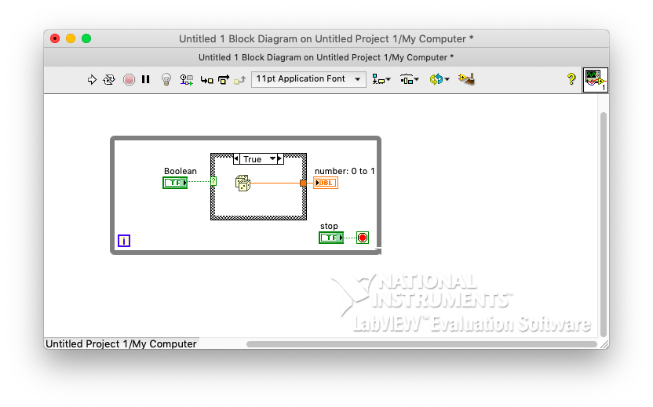
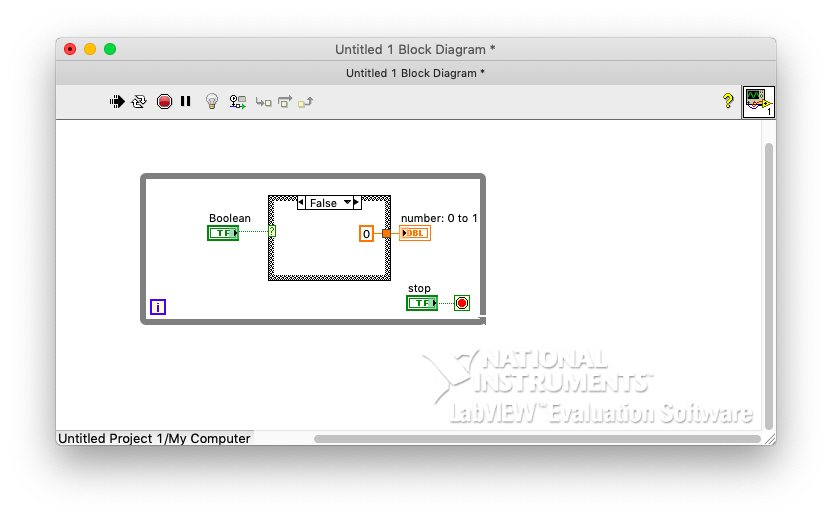
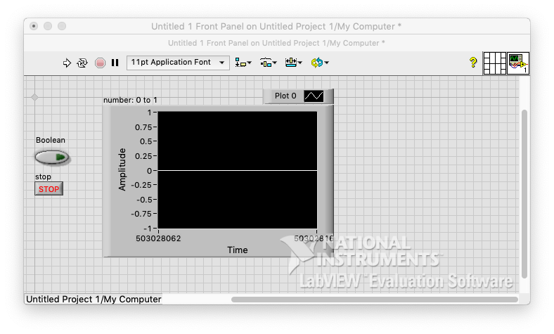
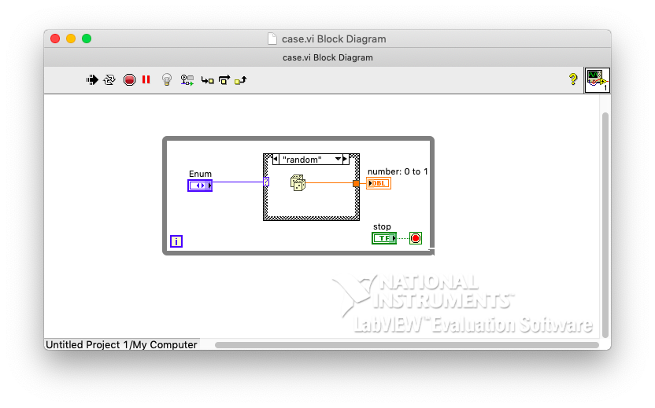
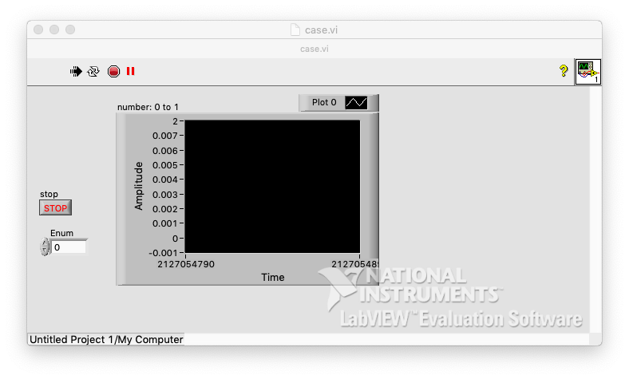
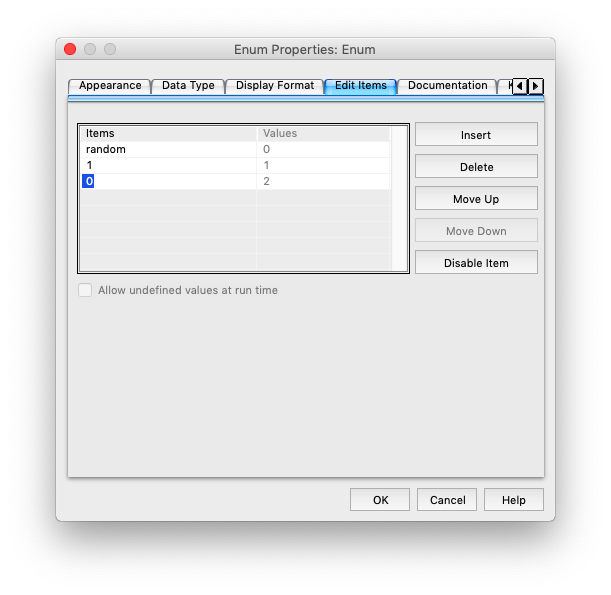
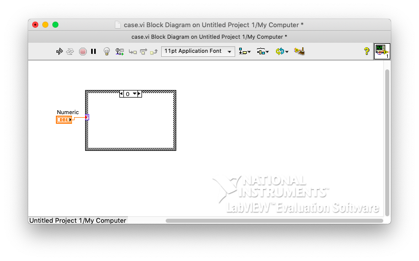
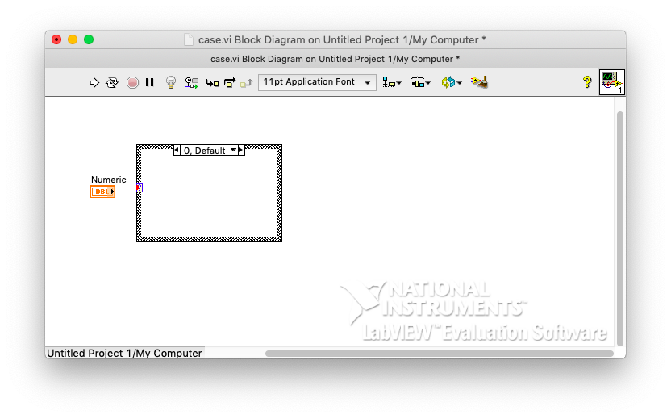
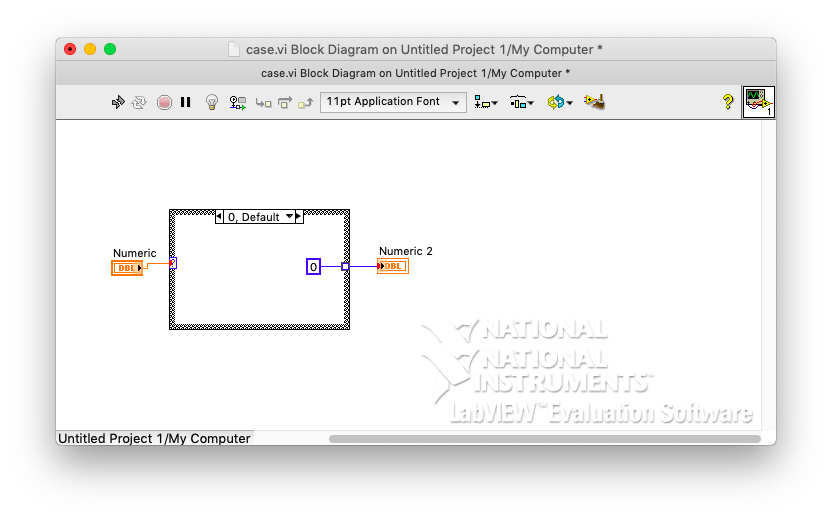
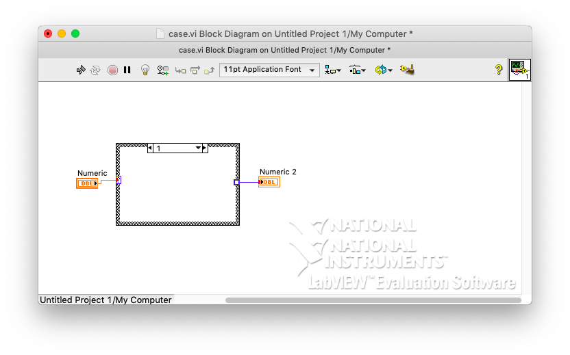

# 5. Case

### # case structure 

- TRUE

- FALSE

  

- Make a case structure in while loop
- Case  -
  - Left bool is true, random num
  - Left bool is false, random is 0

### 

### # case + ENUM 

- Add ENUM in front panel
- Edit Enum 
- 
- Replace bool to ENUM

### # caution cases

- if there is no default -> start btn broken
- like case_default

- All cases should have turnel

- (Start btn broken)

  

  