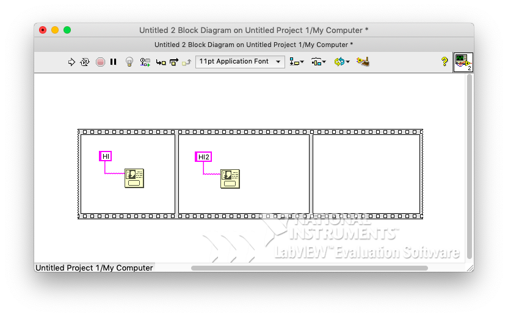
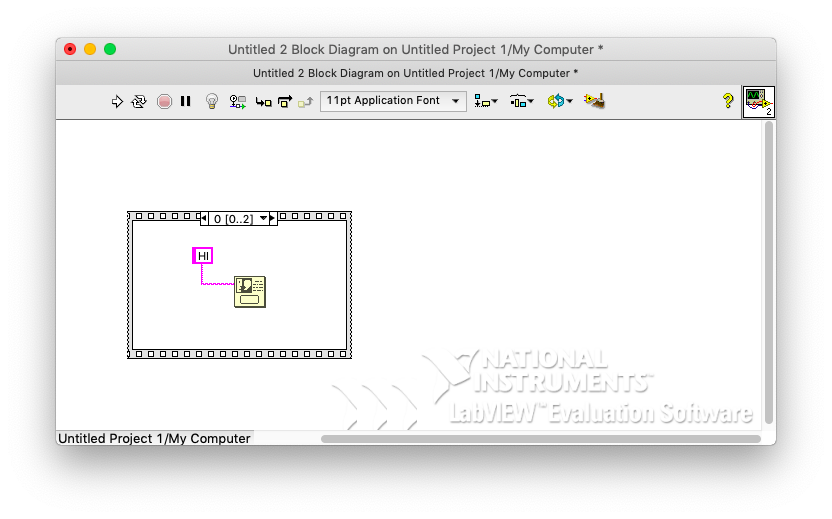

# 6. Sequence Structure

- Making orders(LEFT to RIGHT)
  - structure -> flat Sequence
- click layout right -> Add frame AFTER 
-  click layout left -> Add frame BEFORE 

### # example

- add one button dialog 

  - result : Hi(click ok) -> Hi2
  - normal : 2 window at the same time 

- replace with stacked sequence

  - 
