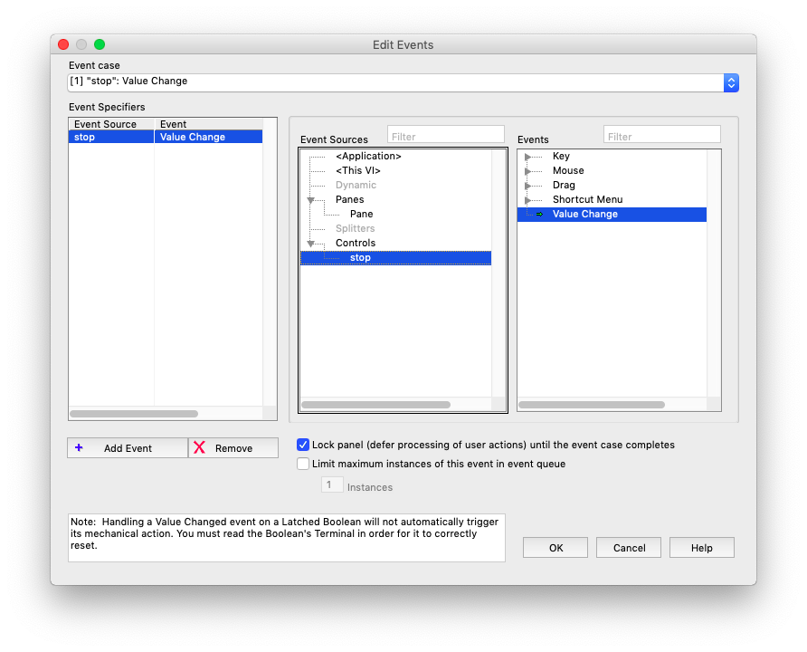
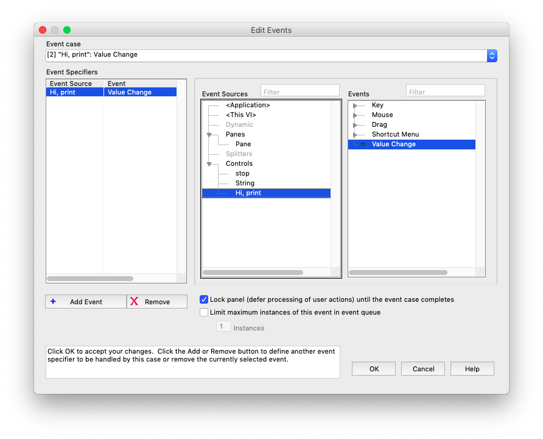

# 7. Event Structure

- called the event when it calls the event

- Less CPU usage than CASE

- normally inside loop

- called one time when it's called

- Event Label

- Timeout terminal

- Event data node

### # example

- create a event structure in while

- Add (bool-stop)  in front panel

- Add event case

  

- Make true constant, connect to stop

- Make string(cancel), connect to new indicator

- Add event case

  

