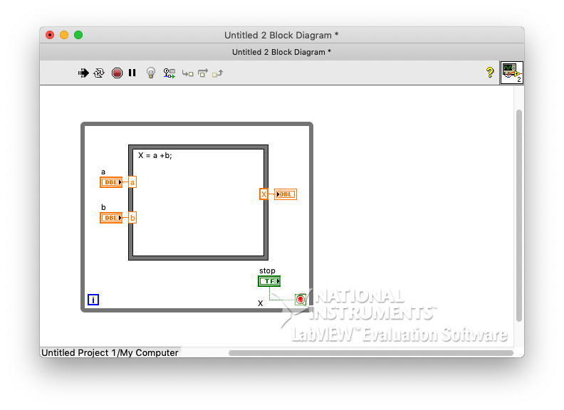
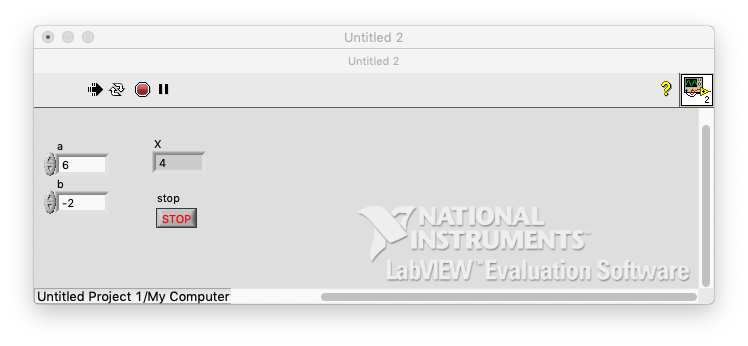

# 8. Formula node

- complex formula

### # example

- Add 2 input left, create control
- add 1 output left, create indicator
- name a, b, and X
- add code : X = a +b;
- add while to check, add stop in panel